# Lab8web
# Risyad Bima Nugraha
# TI.21.B1
# 312110039
<br>
<b>XAMPP dan phpMyAdmin</b>
Buka XAMPP Control Lalu Klik `Start` untuk menjalankan MySQL Server. Pastikan web server Apache dan MySQL Server sudah dijalankan.

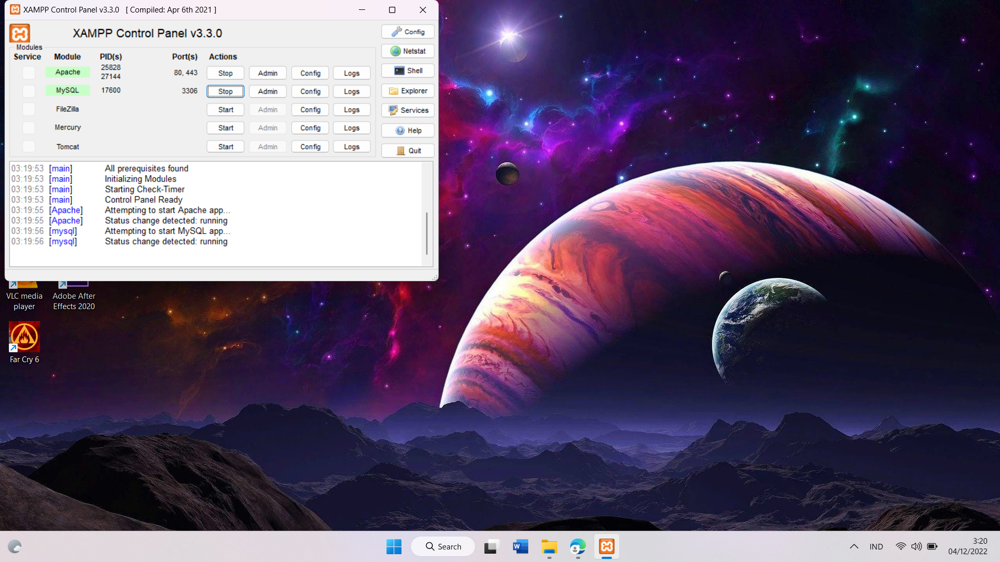<br>
Setelah itu uji coba gunakan URL :
```
http://localhost/phpmyadmin/
```

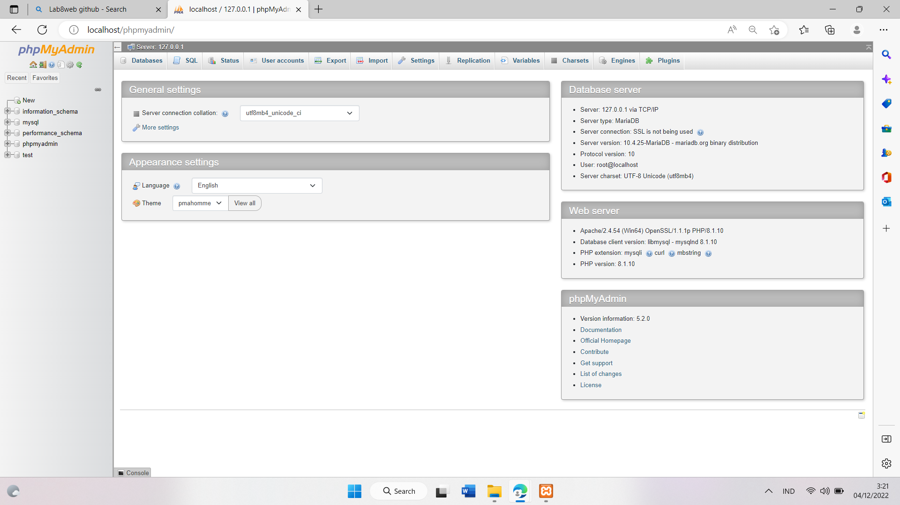<br>

Membuat Database `latihan1`
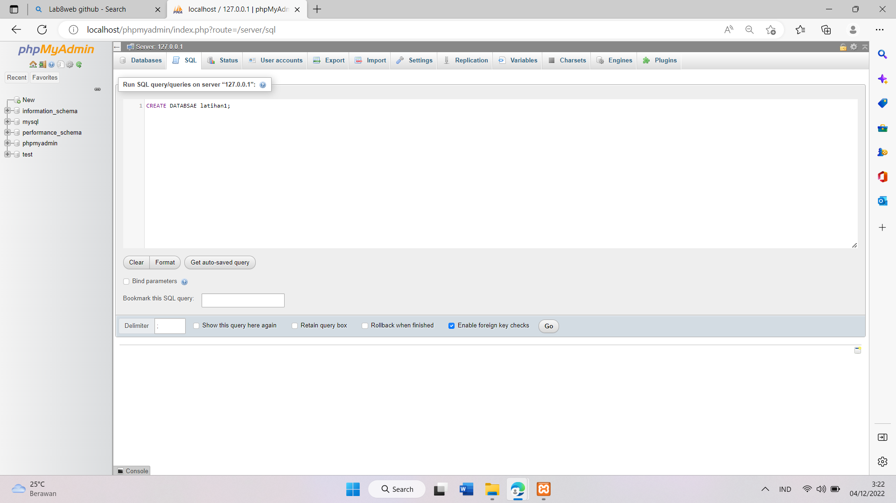<br>

Membuat Table `data_barang`
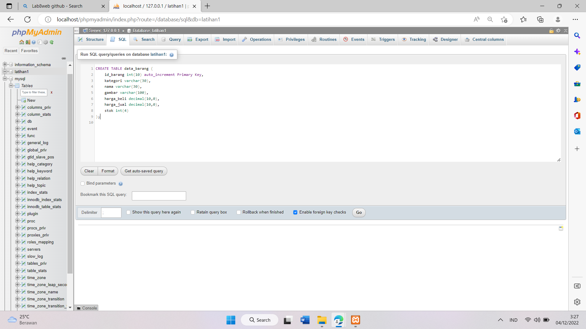<br>

Menambahkan Data
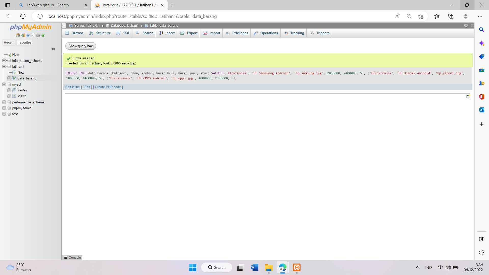<br>

Hasil Penambahan Data
1[step6](ss/s6.png)<br>

<b>Membuat Program CRUD (Create, Read, Update, Delete)</b>

Membuat Folder lab8_php_database pada root directory web server (d:\xampp\htdocs)
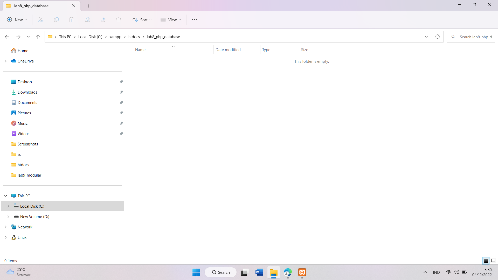<br>

Setelah itu uji coba gunakan URL :
```
http://localhost/lab8_php_database/
```
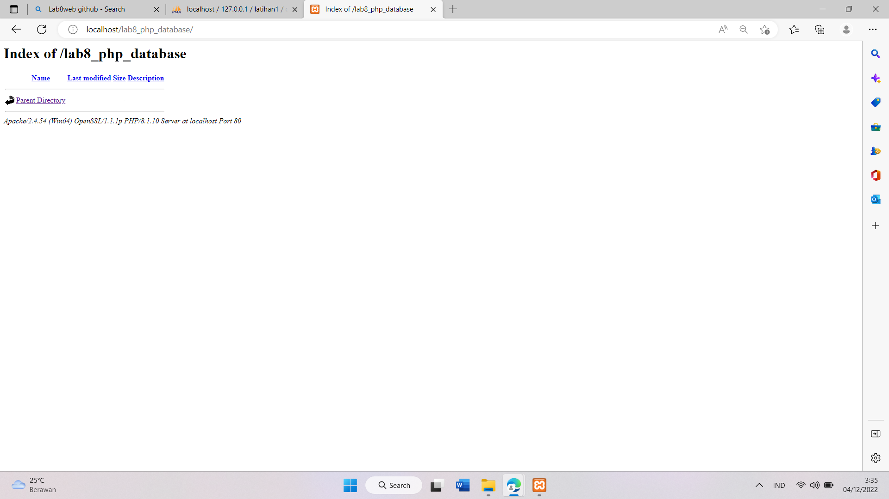<br>

Membuat file koneksi untuk menguji koneksi database lalu tampilkan "Koneksi berhasil" dengan perintah `Echo`
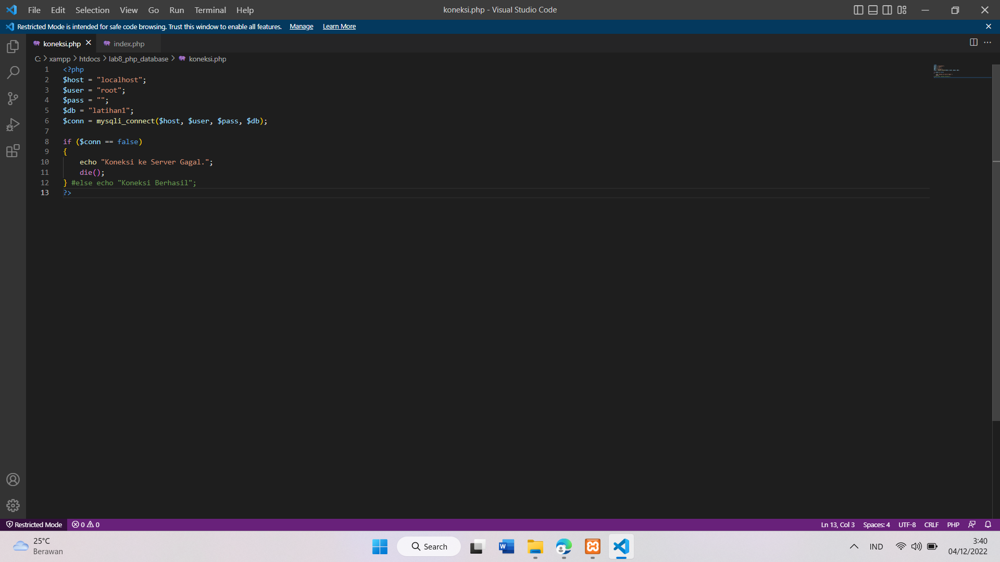<br>

Membuat file index untuk menampilkan data (Read)
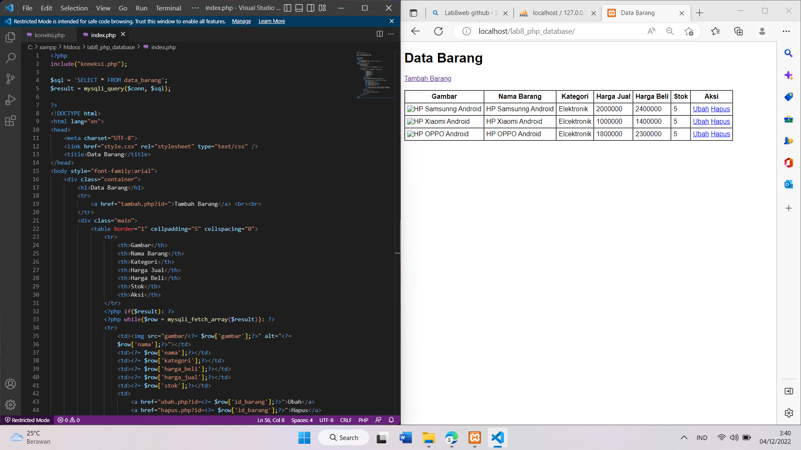<br>

Membuat file baru untuk Menambah Data Barang (Create)
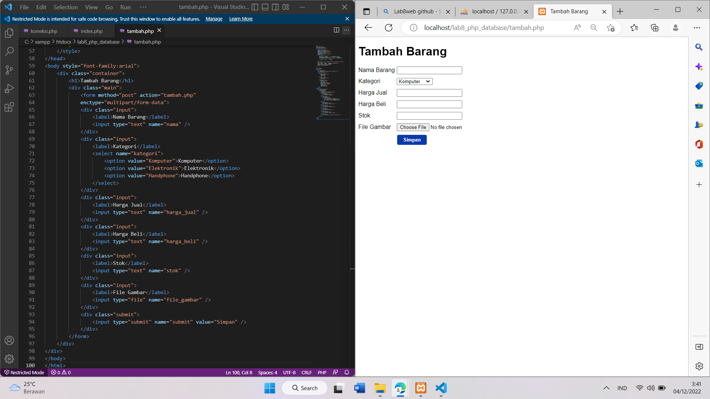<br>

Hasil Dari Penambahan Barang
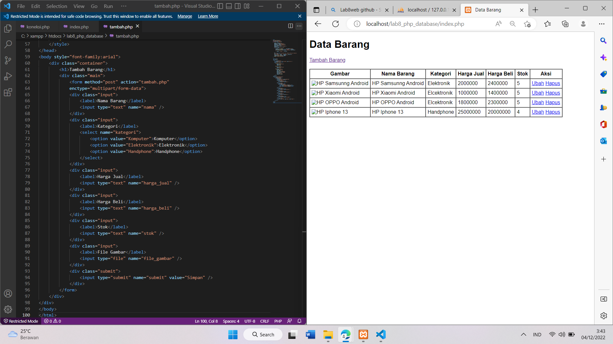<br>

Mengubah Barang Xiaomi
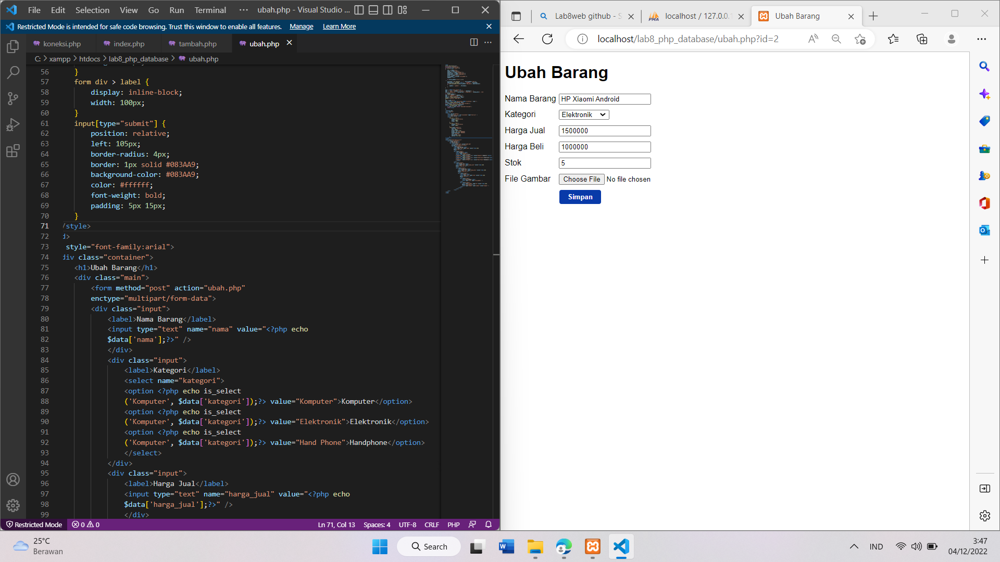<br>

HasiL Dari Pengubahan Barang
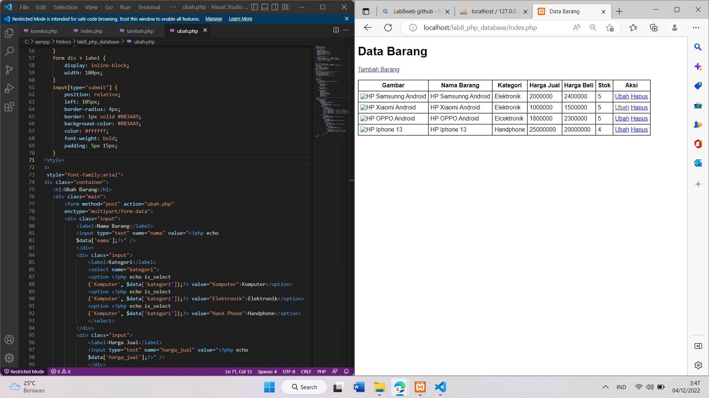<br>

Menghapus Barang
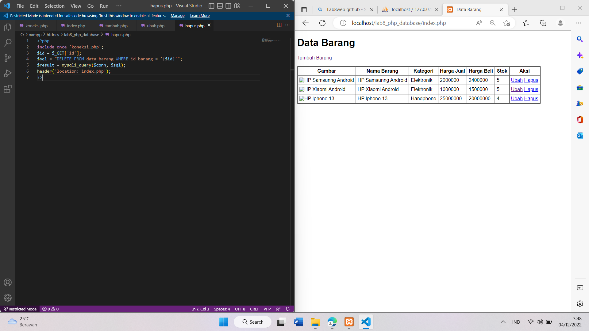<br>
